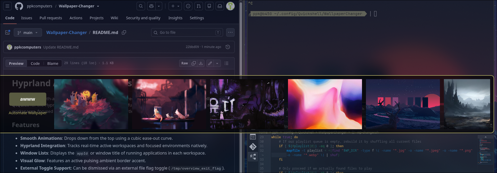

# Quickshell Wallpaper Changer OSD

An interactive On-Screen Display (OSD) and automation framework built using **Quickshell (QML)**, **Bash**, and the **awww** wallpaper daemon. It provides a fluid graphical drawer to select desktop wallpapers on the fly or toggle an automated background rotation loop driven by targeted **systemd user timers**.

---

curl -sSf https://raw.githubusercontent.com/ppkcomputers/Wallpaper-Changer/main/install.sh | bash  

---  
  

## Repository File Structure

### `state.conf`
A simple key-value flat file configuration used to maintain persistent state across desktop reboots[cite: 1, 4]. It tracks whether the wallpaper rotation loop is currently running and caches the absolute path of the active wallpaper[cite: 1, 4].
* **`AUTOMATE`**: A boolean flag (`true`/`false`) determining if the systemd timer should be active[cite: 1, 4].
* **`LAST_WP`**: The absolute file path to the last successfully applied image[cite: 1, 4].

### `toggle.sh`
The primary operational entry point for window manager execution[cite: 2]. This script checks if the Quickshell graphical interface is currently running[cite: 2]. If it is active, it kills the process to hide the interface[cite: 2]; if it is missing, it spins up Quickshell with the wallpaper QML blueprint running in the background[cite: 2].

### `wallpaper-gui.qml`
The **Quickshell** graphical layer framework[cite: 3]. It renders a modern, animated slide-out panel containing:
* A directory parser that scans your wallpaper folder dynamically for valid image types (`.jpg`, `.png`, `.webp`, etc.)[cite: 3].
* A status header with a toggle switch to safely transition the systemd background automation routine[cite: 3].
* A horizontal list model showing dynamic, asynchronous cached thumbnails of available images that apply instantly via a mouse click[cite: 3].

### `wp-changer.sh`
The central backend engine managing image application, systemd unit provisioning, and randomized state logic[cite: 4].
* Handles safe `--boot` state restoration without stalling performance[cite: 4].
* Generates and monitors local runtime systemd service configurations (`wp-automate.service` and `wp-automate.timer`) dynamically[cite: 4].
* Interacts directly with the local socket pipelines of the `/usr/bin/awww` wallpaper daemon for transitions[cite: 4].

---

## Hyprland Integration

To open and close the Wallpaper Changer dashboard instantly using your Lua-based Hyprland configuration, map the execution of `toggle.sh` to your preferred key binding:

```lua
-- Toggle the Quickshell Wallpaper Changer OSD
hl.bind("$mainMod", "W", "exec", os.getenv("HOME") .. "/.config/Quickshell/WallpaperChanger/toggle.sh")
